# My Daily Space

My Daily Space is a **web application** designed to help you stay organized and productive.
It lets you **keep track of your daily notes, goals, expenses, to-dos, files, and reminders**, all in a single place.
The application is implemented using **JSP, Servlets, JDBC, MySQL, and MVC architecture**.

---

##  Features

 **User Authentication**

* User registration and login with password authentication.
  
 **Notes Module**

* **Add, view, and delete notes.**
* **Export Notes to PDF:**

  * Download **individual notes as PDF**
  * Combine **multiple notes into a single PDF**
  * Download **all notes at once in a PDF**
    
    
**Reminders**

* Set short reminders for future tasks.
* The application shows:

  * **How soon:** “Coming soon in 6 minutes, 6 hours, or 6 days”
  * **Whether deadline has gone or not**
    

 **Goals Module**

* Set goals with:

  * **Priority:** high, medium, or low
  * **Progress:** percentage of completion
  * **Deadline:** track deadline for each goal
    

 **To-Do List**

* Add, view, and delete tasks.
* Set task **status:** Pending, Completed, or In Progress


 **File Upload**

* **Support for any file format (PDF, images, documents)**
* File can be downloaded or viewed later directly from the application.

 **Expense Manager**

* Keep a record of expenses.
* Filter transactions by criteria.
* View total balance left or amount spent.
* Display transactions in **chart form**.
* **Export transactions to Excel** for further analysis.

---

##  Tech Stack

* **Front-end:** JSP, HTML, CSS, Bootstrap
* **Back-end:** Servlets, JDBC, MVC architecture
* **Database:** MySQL
* **Server:** Apache Tomcat
* **IDE:** Eclipse or IntelliJ
* **Web Container:** Apache Tomcat (v9+)

---

## Project Structure (MVC)

```
MyDailySpace/
 ├─ src/
    ├─ controller/ (Servlets) 
    ├─ model/ (JavaBeans, POJOs) 
    ├─ dao/ (Database Access) 
 ├─ WebContent/
    ├─ WEB-INF/
       ├─ view/ (JSP files) 
    ├─ css/
    ├─ images/
 ├─ pom.xml (if using Maven) 
```

## PREVIEW
Here are some screenshots of the My Daily Space application in action:

 Login Page


 Dashboard
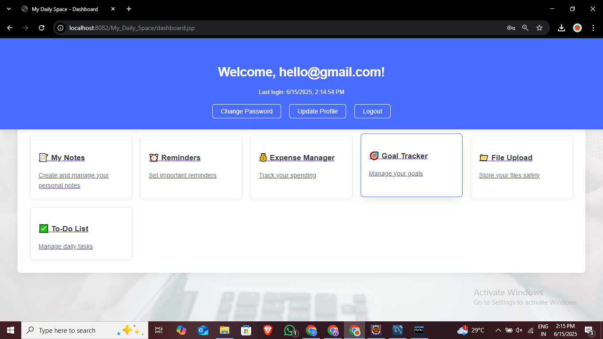

 Notes Section
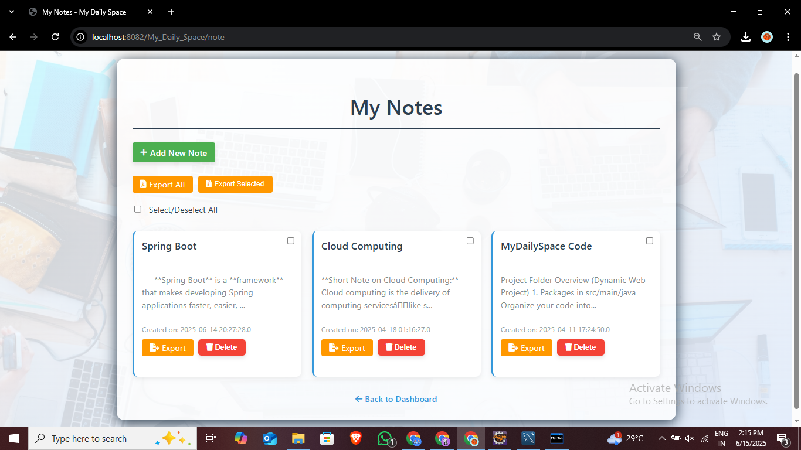
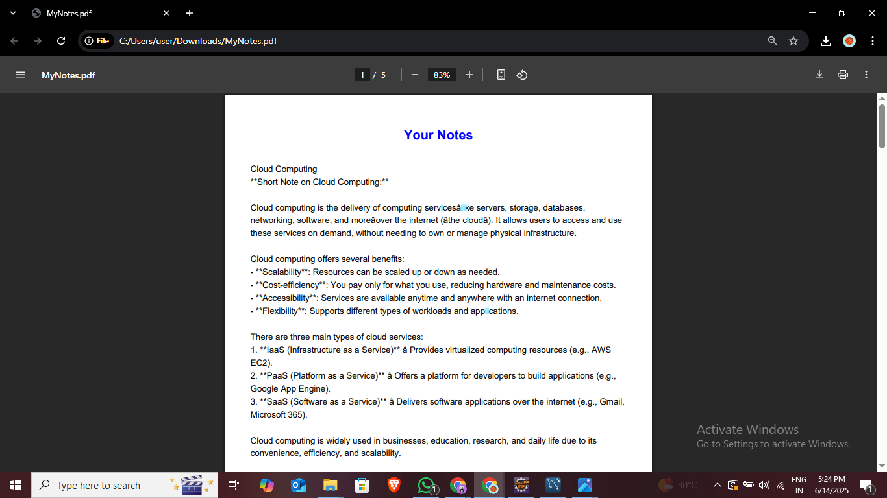

 Reminders Section
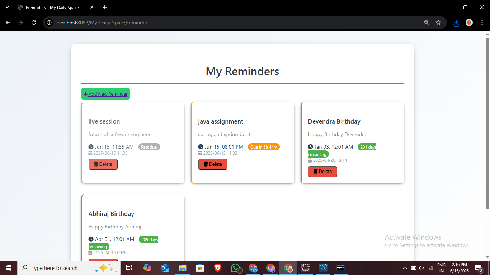
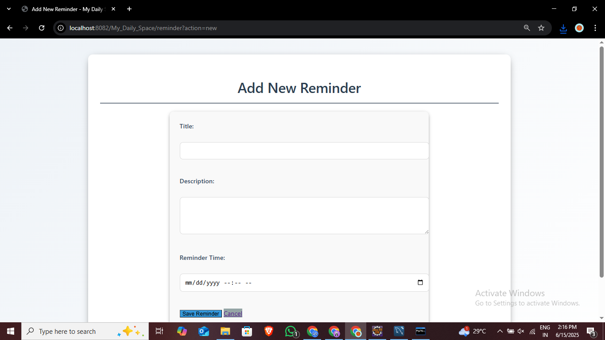

 Expense Manager Section
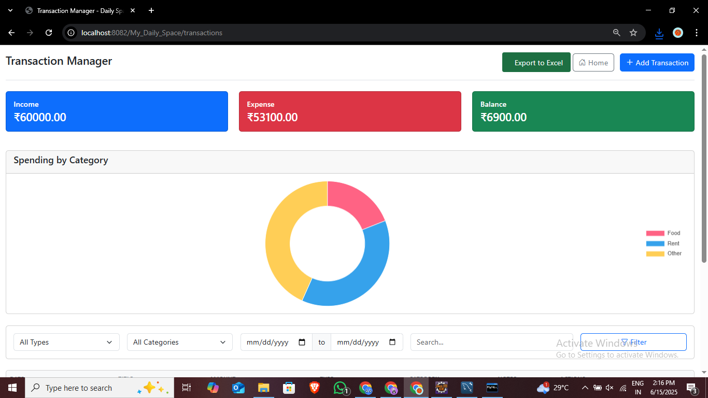
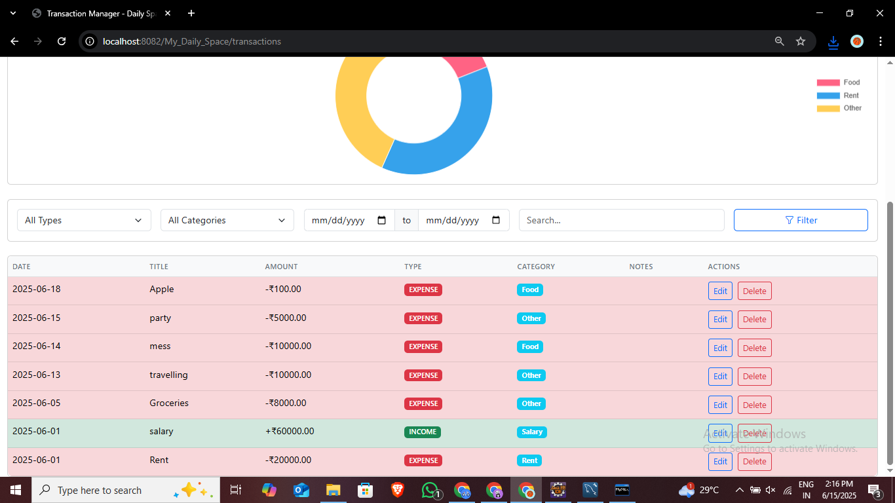
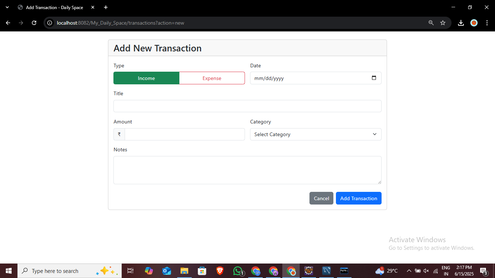
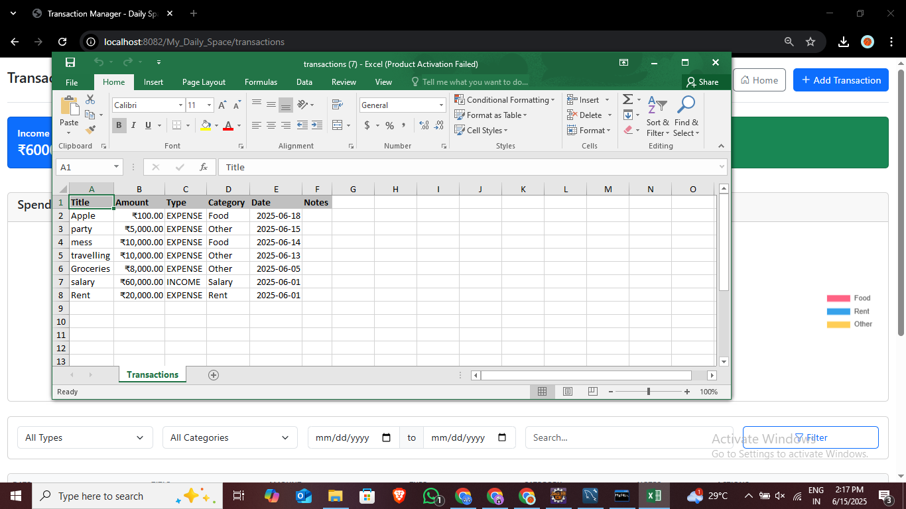

 Goals Section
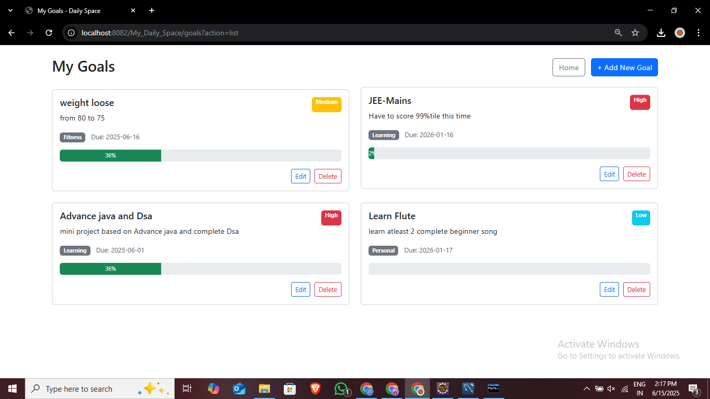
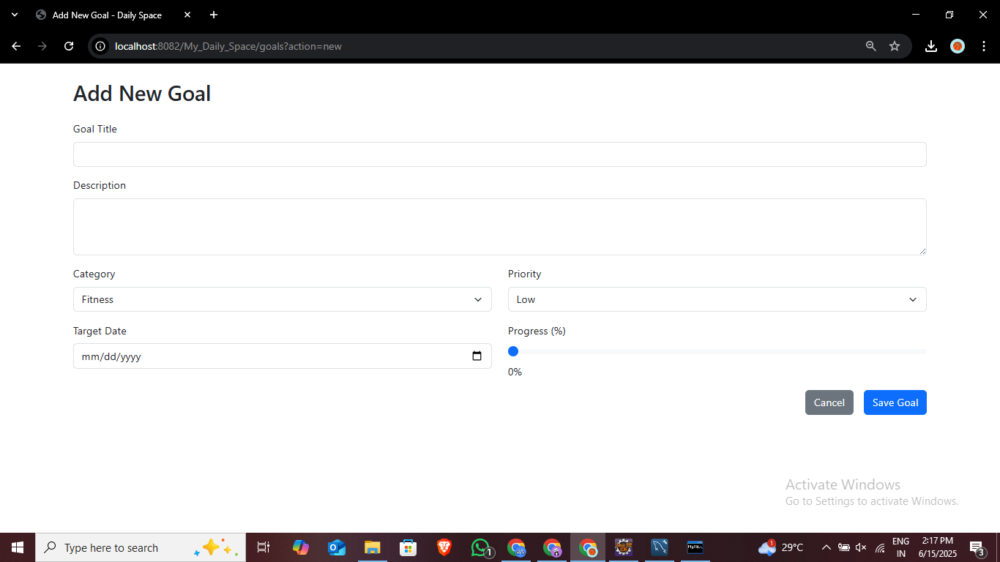

 To-Do List Section
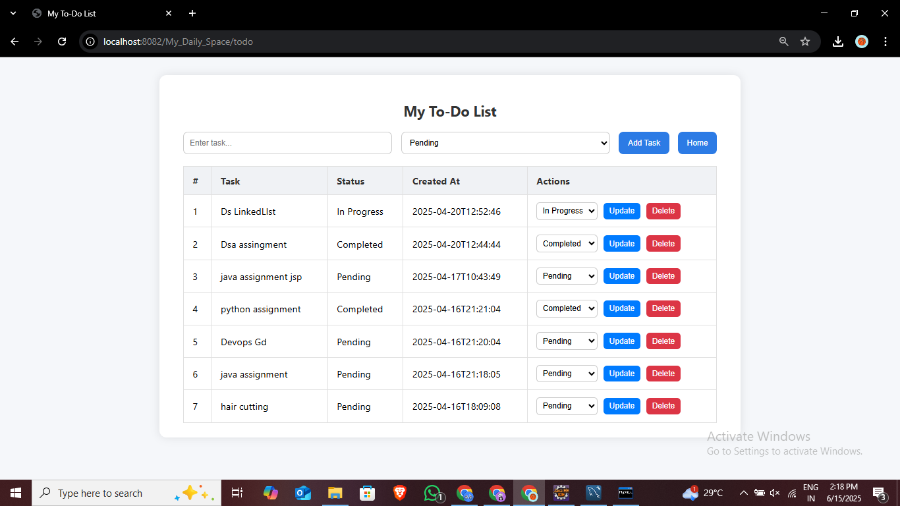

 File Upload Section
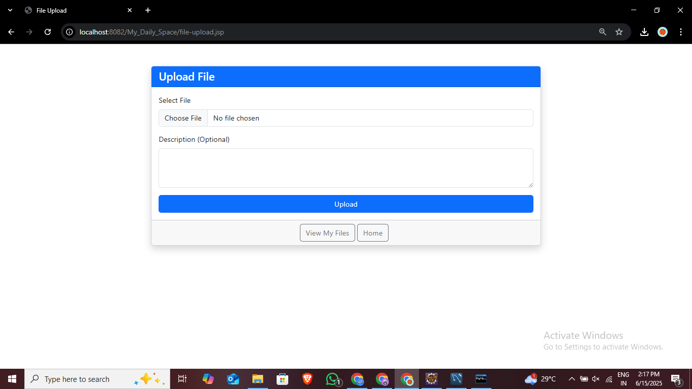
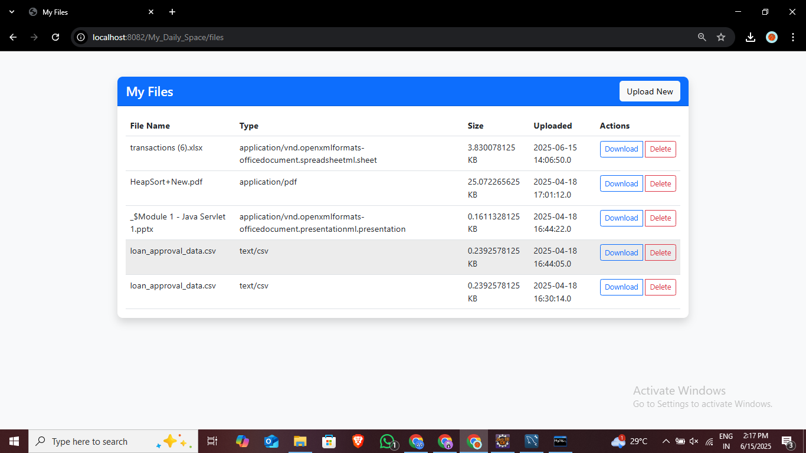


##  Notes

* The application performs **CRUD operations** on all modules.
* User sessions are maintained upon login and destroyed upon logout.
* **Export to PDF and Excel**, and **Chart view**, make it convenient to view and backup your data.

---


